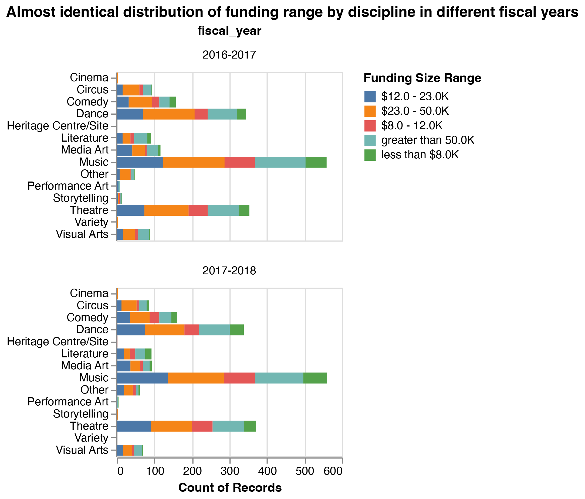

---
title: "Canadian Art Project Funding Ranges Prediction Using Random Forest"
author: "Amelia Tang"
date: "1/18/2022"
output:
  pdf_document:
    toc: yes
  github_document:
    toc: yes
  html_document:
    toc: yes
always_allow_html: yes
bibliography: can_heritage_reference.bib
--- 

```{r setup, include=FALSE}
knitr::opts_chunk$set(echo = FALSE)
library(knitr)
library(kableExtra)
library(tidyverse)
```
# Audiance Persona 

Astrid is enrolled in a Data Science boot camp and is trying to switch her career from freelance graphic design to data science. She has taken basic math and statistics in college but might not be able to do math proofs for machine learning algorithms. She has learned most of the commonly used terminologies in data science, such as training/testing data and different metrics. She also learned the general ideas of popular machine learning algorithms from the boot camp. She is curious about how machine learning can be applied to the real world. As a former art practitioner, she is interested in how big data is used in the art industry.

# Abstract / Executive Summary 

The Government of Canada plays a vital role in preserving Canadian heritage through funding art projects. Eligible Canadian artists and art organizations may want to know the potential ranges of funding they can receive for budgeting purposes. In this project, we built a predictive model utilizing popular machine learning algorithms for multi-class classifications, including Logistics Regression, Multinomial Naïve Bayes, Support Vector Classification (SVC), and Random Forest. The model predicted art projects’ funding ranges using features such as the projects’ locations, disciplines, and target audiences, which were not indicative of visual properties. We compared the performance of each algorithm using three metrics: weighted average f-1, weighted-average recall, and weighted-average precision. The results showed that the random forest algorithm outperformed others with a weighted-average f-1 score of 0.69, a weighted-average recall of 0.69, and a weighted-average precision of 0.69. Therefore, we could use the features non-indicative of visual characteristics to predict the funding ranges that the government would grant for art projects in Canada.

# Introduction

The Canadian Arts Presentation Fund (“the Fund”) provides financial assistance to arts festivals presenters and performing artists [@canada]. The Fund’s performance was evaluated based on the diversity of the art projects it covered and broadness of the communities it reached. The key mission of the Fund was to support a variety of art projects in all parts of the country based on economic values that the projects could bring to local communities [@CandanaEvaServices].

In recent years, many studies used neural network algorithms and features indicative of visual properties to predict values of art work. However, the models with visual features, such as the image of the art work, did not outperform the models using numeric and textual data only [@aubry]. In most cases, image data presenting the art work alone failed to appraise the values [@ayub]. 

In this project, we built classification models to predict approved funding ranges of Canadian art projects based on textual features that reflected social, cultural and geographical diversities. We did not add any features related to the visual characteristics of the art projects. After comparing the performances of four algorithms for multi-class classification, logistics regression, Naïve Bayes, Support Vector Classification (SVC) and Random Forest, we constructed a final predictive model using Random Forest. 

# Methods
## Data Collection
From fiscal year 2016-2017 and fiscal year 2017-2018, the Government of Canada collected data on the art projects accepted and the funding sizes approved. The data set is available on the Canada’s Open Data website and can be found [here](https://open.canada.ca/data/en/dataset/92984c11-6fd4-40c4-b23c-e8832e1f4cd5). The data set has 1358 rows of data. Each raw of the data contains the project’s name, location information, including community, city, region and province, presenter information, such as organization names, disciplines and target audience. The Fund also reported the funding size for each art project in the data set. All the features included in this data set were categorical features.  

## Data Processing
We observed that the funding sizes reported were not continuous, so we divided the funding size data into five ranges, less than 8 thousand Canadian dollars (`less than $8.0k`),  from 8 to 12 thousand Canadian dollars (`$8.0k-12.0k`), from 12 to 23 thousand Canadian dollars (`$12.0k-23.0k`), from 23 to 50 Canadian dollars (`$23.0k-$50.0k`), and greater than 50 thousand Canadian dollars (`over $50.0k`). We used 10%, 25%, 50% and 75% percentiles of the funding size data as the cutoffs for the ranges. 

When selecting features for our classification model, we noticed the similar patterns of the funding ranges for each discipline in both fiscal years. Therefore, fiscal year would not be a meaningful predictor for funding ranges and we discarded this feature. Figure 1 showed the detailed distributions for both fiscal years. 

```{r drop-fiscal-year, fig.align = 'center', echo=FALSE, fig.cap="Comparison of the distribution of funding ranges 2016-2017 vs 2017-2018", out.width = '70%'}

```
We also discarded the data on regions because there was already data on provinces of the art projects. It would be repetitive had we included both. In addition, we excluded the organization names of the art projects because there were too many unique names and thus would not be informative when predicting funding ranges. Similarly, we did not choose to use data on other disciplines because we already included data on disciplines and there were many unique values in other disciplines. The key features we included for our projects were province, community type, grant or contribution, presenter type, project type, project sub-type, disciplines and audiences. 

## Data Analysis  
We used the Python programming language [@Python] and the following Python packages to perform the analysis: numpy [@2020NumPy-Array], pandas [@mckinney2010data] and sikit-learn[@pedregosa2011scikit]. The code used to perform the analysis and create this report can be found [here](https://github.com/UBC-MDS/canadian_heritage_funding).   

We conducted a conventional 80:20 split to create the training and testing data. We created a base-case model using the dummy classifier in the scikit-learn package [@pedregosa2011scikit] to serve as a reference.  Further, we chose four machine learning algorithms commonly used for multi-class classification problems, Logistics Regression, Multinomial Naïve Bayes, Support Vector Classification (SVC) and Random Forest. We again used scikit-learn package [@pedregosa2011scikit] to build classification models. 

There were class imbalances in our training dataset. Table 1 shows that we had different sample sizes for the five ranges. To deal with this issue, we set the class weight parameter to “balanced” for Logistics Regression, Support Vector Classification (SVC), and Random Forest. When set to balanced, the class weight parameter would tune the model to assign a class weight inversely proportional to the sample size in each class. We also set the max iteration parameter of Logistics Regression to 1000 for the solver to converge.


```{r class_imbalance, message=FALSE, warning=FALSE, echo=FALSE, fig.cap="Table 1. Count of each funding ranges (Observed class imbalances)", out.width = '100%'}
class_imbalance <- read_csv("../results/target_feature_counts.csv") |>
  kbl(caption = "Count of each funding ranges (Observed class imbalances)") |>
  kable_styling(latex_options = "hold_position")
class_imbalance
```

Because our problem was a multi-class classification problem, we used relevant metrics, weighted-average f-1, weighted-average recall and weighted-average precision to evaluate the model performances. 

# Results 
After comparison, we found that the Random Forest model performed the best among the four algorithms we used with our training dataset. We also noticed that the Random Forest model required the longest fit time for our data, though all four algorithms were reasonably time-efficient and computationally inexpensive. Table 2 shows fit time, weighted-average f-1, weighted-average recall, and weighted-average precision for each model.

```{r model_compare, message=FALSE, warning=FALSE, echo=FALSE, fig.cap="Table 2. Random Forest performs the best", out.width = '100%'}
model_compare <- read_csv("../results/model_comparison.csv") 
names(model_compare)[1] <- ""
model_compare |>
  kbl(caption = "Random Forest performs the best") |>
  kable_styling(latex_options = "hold_position")
``` 

To further tune the Random Forest model, we conducted hyperparameter optimization and optimized the maximum number of features, class weight (balanced or none), and maximum number of depths. The maximum number of depths was important for tree-based models like Random Forest to avoid overfitting.

Our tuned classification model using the Random Forest algorithm had a weighted-average f-1 score of 0.69, a weighted-average recall of 0.69, and a weighted-average precision of 0.69 when tested using our test data. Table 3 shows the f-1 score, recall, and precision for each class. The test scores were not the most ideal, but the model performed reasonably well compared to the base-line model as well as the other algorithms that we explored.

```{r best_model, message=FALSE, warning=FALSE, echo=FALSE, fig.cap="Table 2. Test Scores of the Tuned Random Forest Model", out.width = '100%'}
best_model <- read_csv("../results/test_result.csv") 
names(best_model)[1] <- ""
best_model |>
  kbl(caption = "Test Scores of the Tuned Random Forest Model") |>
  kable_styling(latex_options = "hold_position")
``` 

# Conclusion

We provided a machine learning model to predict the funding ranges of Canadian art projects using the Random Forest algorithm. This model achieved some improvements over our base-case dummy classifier and other algorithms that we explored: logistics regression, Multinomial Naïve Bayes, and Support Vector Classification (SVC). We also found that categorical features that described the basics of the art project, such as location and presenter type, but did not contain information on the visual properties, could reasonably predict the funding ranges approved by the Canadian Arts Presentation Fund.

However, our model was not without limitations. We could further explore techniques to solve the class imbalance problem for the Multinomial Naïve Bayes algorithm. We might improve the model performance by adjusting the cutoffs for the ranges to create more balanced classes. We could expand our choices by exploring other algorithms such as k-Nearest Neighbors. Moreover, we could add some features that were indicative of visual properties of the art projects, such as the images of the costumes, to see if the model would perform better.  

# References

